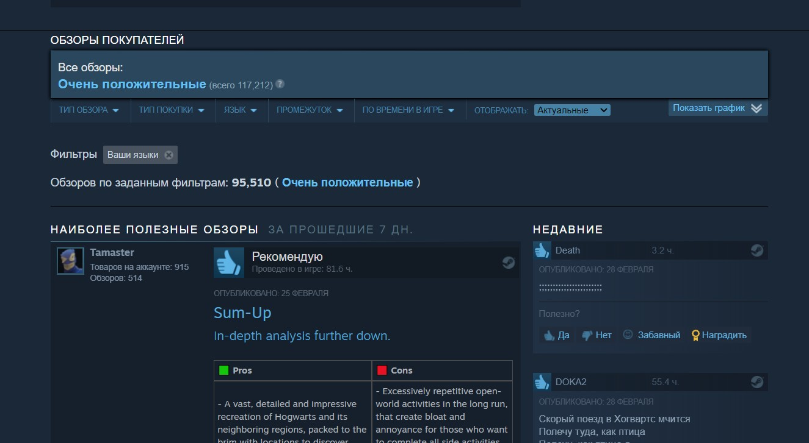
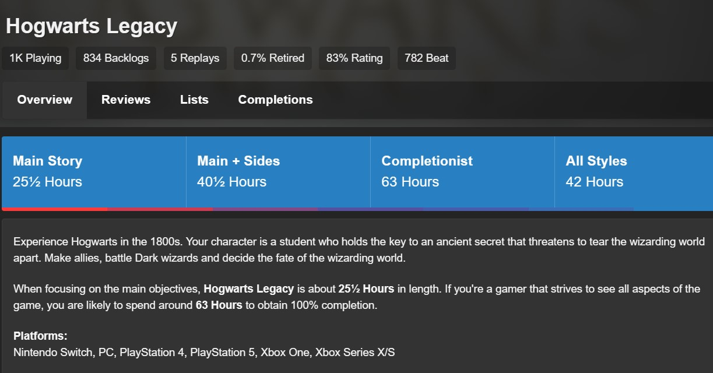
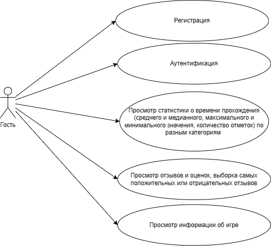
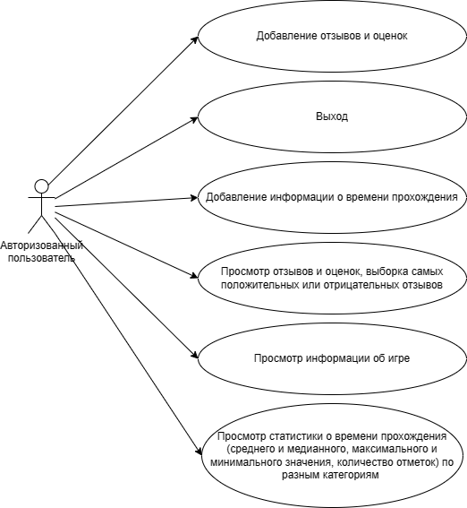
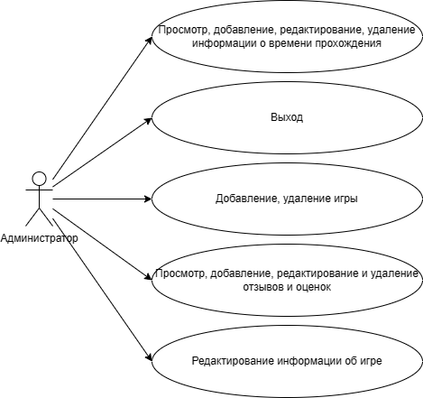
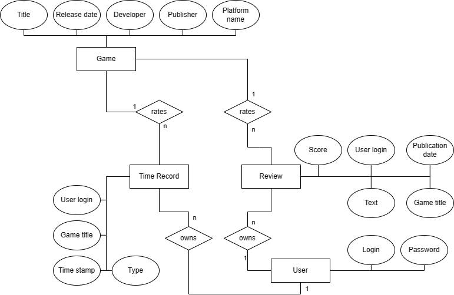
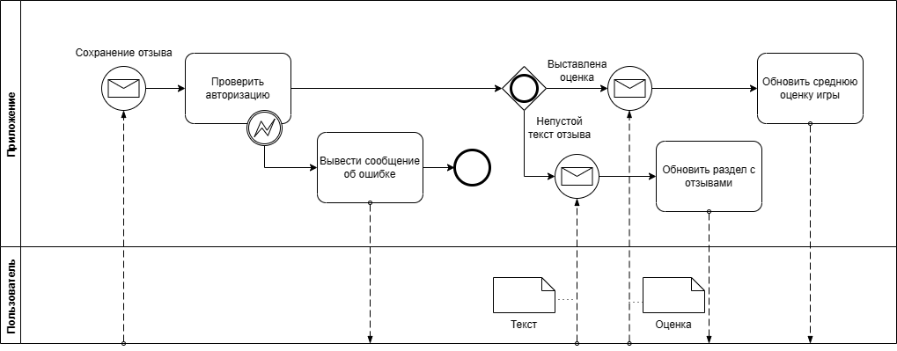
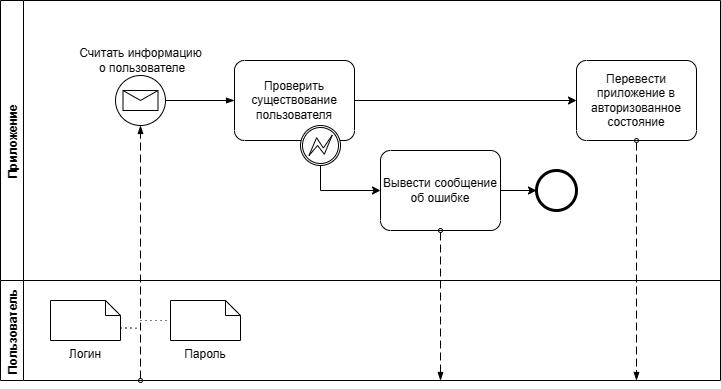
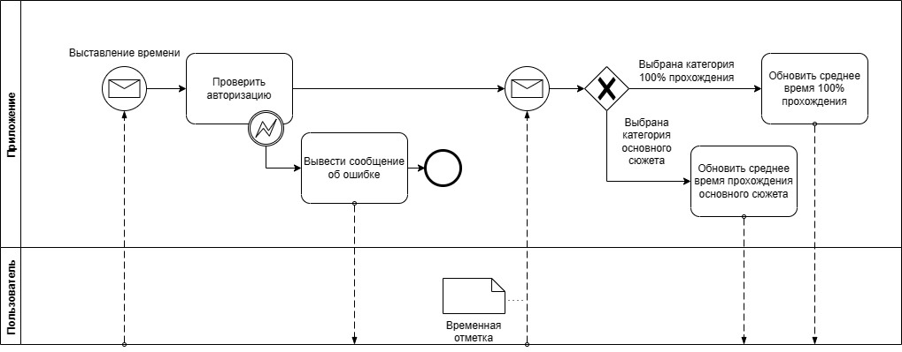

# Приложение для отслеживания времени прохождения игр.

# GameTime

## Идея проекта

Приложение, позволяющее собирать у пользователей информацию об играх:
- время прохождения игры(время прохождения сюжета время 100% прохождения);
- отзывы и оценки;
Также приложение позволит посмотреть общую информацию об игре: название, жанры, разработчика, издателя и т.д.

## Описание предметной области

Приложение будет представлять собой библиотеку видеоигр. У каждой видеоигры есть издатель, разработчик, название, жанры, отзывы, среднее время прохождения. Каждый авторизованный пользователь может оставить время прохождения у каждой игры, оставить отзыв и оценку. Каждый не авторизованный пользователь может посмотреть среднее время прохождения каждой игры, отзывы и среднюю оценку. Модерацией отзывов занимается администратор. также администратор может добавить в библиотеку новую игру или удалить какую-то игру из библиотеки.

## Краткий обзор существующих решений

Анализ аналогичных решений будет проведен по следующим критериям:
- возможность указать время прохождения игры;
- возможность оставлять оценки и отзывы;
- наличие интерфейса на русском языке;

1. Steam

Один из самых популярных магазинов видео игр. Позоляет не только покупать игры, но и оставять обзоры на них. Также Считает время проведенное в игре, но не может собирать информацию времени прохождения. Имеет русский интерфейс.

2. HowLongToBeat

Сайт, на котором можно оставлять обзоры и оценки видеоигр, а также оставлять время прохождения игры по 3 категориям: основной сюжет, основной сюжет + некоторые побочные задания, 100% прохождение. Данный сайт имеет серьезный недостаток, он полностью на английском языке.

|Сервис|Время прохождения|Отзывы и оценки|Русский язык|
|-|-|-|-|
|GameTime|+|+|+|
|steam|-|+|+|
|HowLongToBeat|+|+|-|
## Актуальность проекта

Разрабатываемое приложение может быть полезно для интернет-магазинов видеоигр. Приложение представляет собой не только библиотеку видеоигр, но и способно собирать у пользоватей статистику, которая может пригодиться другим людям при покупке игры.

## Use-Case - диаграммы.

Виды пользователей:
1. Гость

2. Авторизованный пользователь

3. Администратор

## ER-диаграмма сущностей 

## Текстовое описание пользовательских сценариев

1. Авторизация

Пользователь вводит свой логин и пароль. Система проверяет существование пользователя с таким логином и паролем. Если такой пользователь существует, переводит приложение в режим авторизованного пользователя.

2. Сохрание отзыва и оценки

Пользователь вводит текст отзыва и выставляет оценку. Система проверяет авторизован ли пользователь. Если текст отзыва не пустой, он сохраняется и выводится в раздел отзывов. Если оценка была выставлена, она сохраняется, и средняя оценка игры обновляется.

3. Сохрание времени прохождения

Пользователь вводит время потраченное на прохождение игры и выбирает категорию прохождения. Система проверяет авторизован ли пользователь. Временная отметка сохраняется, и обновляется среднее время в соответствующей категории.
 
## Формализация бизнес-правил

